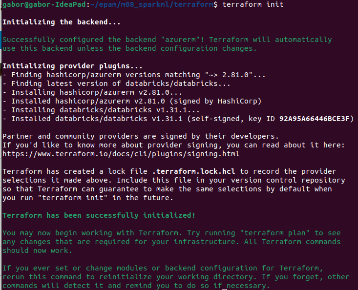
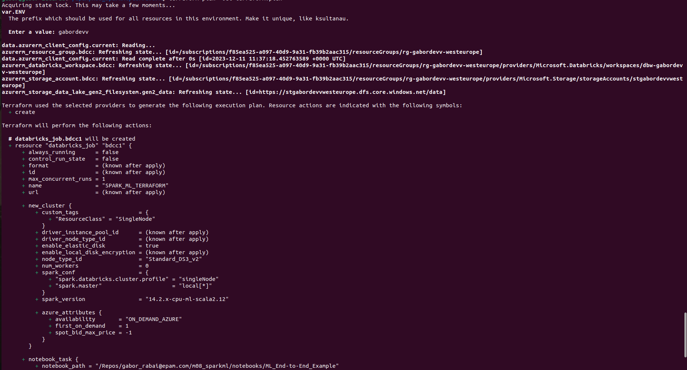
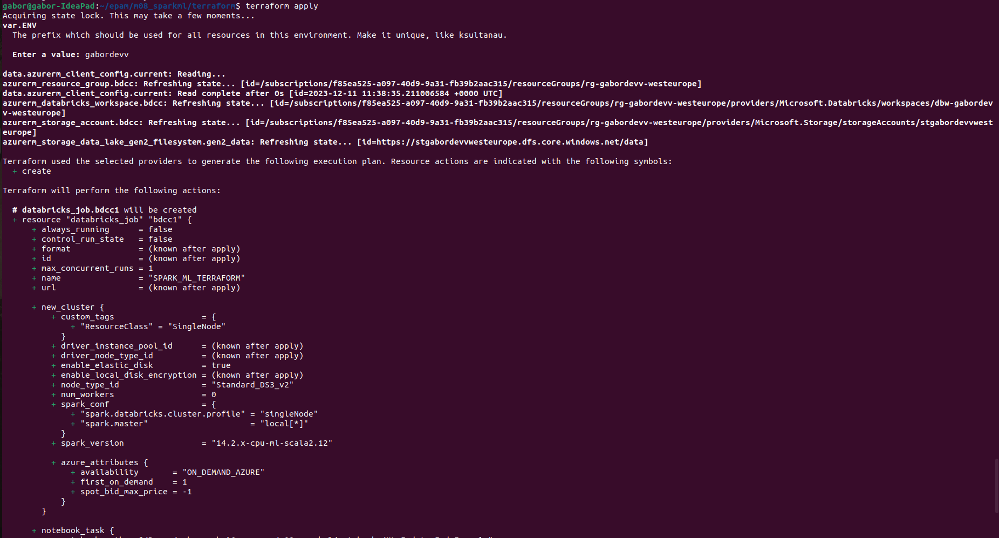
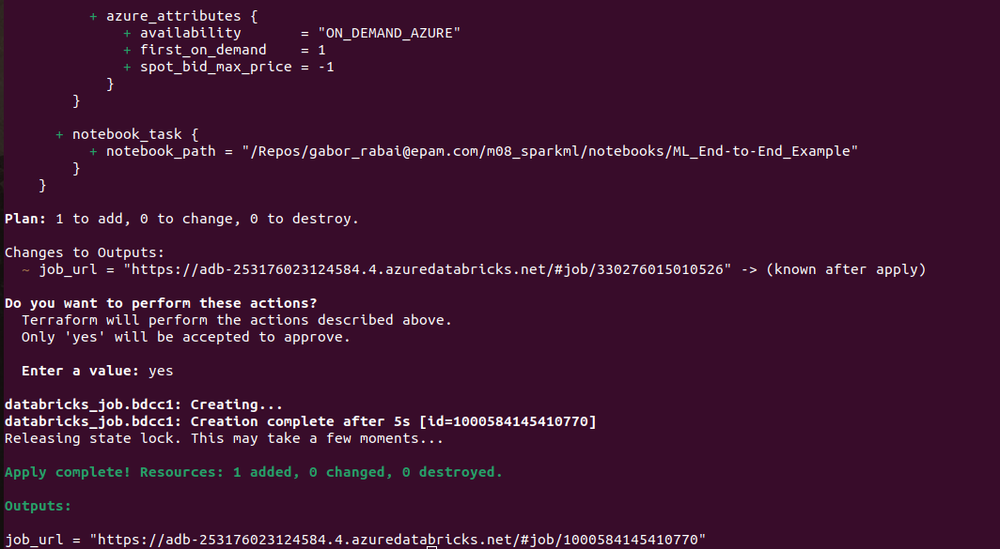
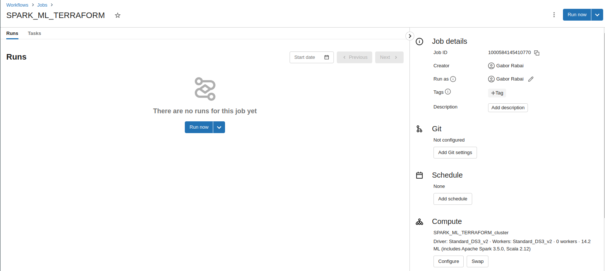
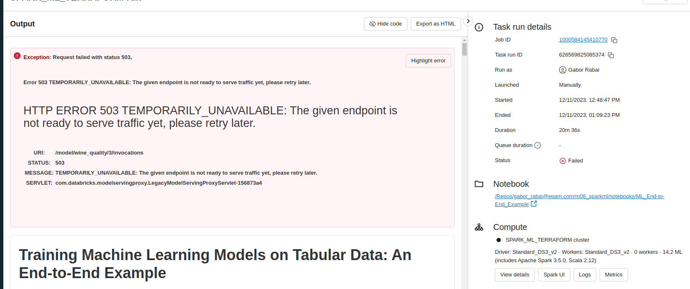
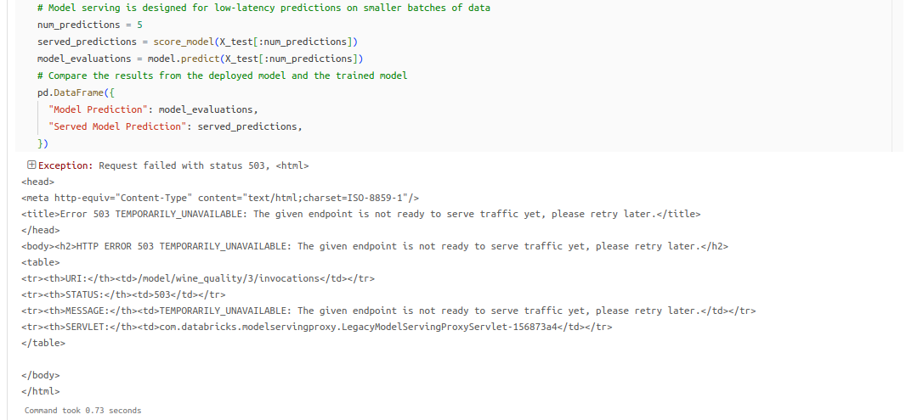
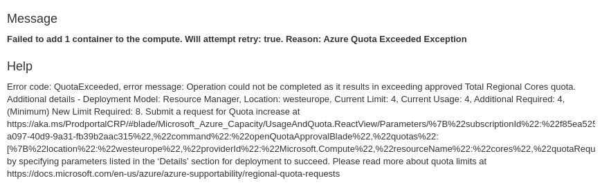

Steps:
* terraform init

* terraform plan -out terraform.plan

* terraform apply terraform.plan

* After opening the job_url run the job

 * Job will fail at last step, when it tries to productionize the model for low latency predictions, use MLflow model serving to deploy the model to an endpoint. This step is not possible to complete because of the limitations of free tier accounts. To start serving a model databricks deploys a unique single node cluster(Standard DS3_v2 type) that would need 4 additional cores on top of the cluster that is running job. The free tier limit is 4 cores/region and this step would require double the amount.(the error message states that the given endpoint is not ready to serve, because i didn't enable serving for the model version to avoid exceeding limitations)

 
 

 * The message if I tried to serve endpoint

 

 * The ML_End-to-End_Example.html file contains the output of the job.
